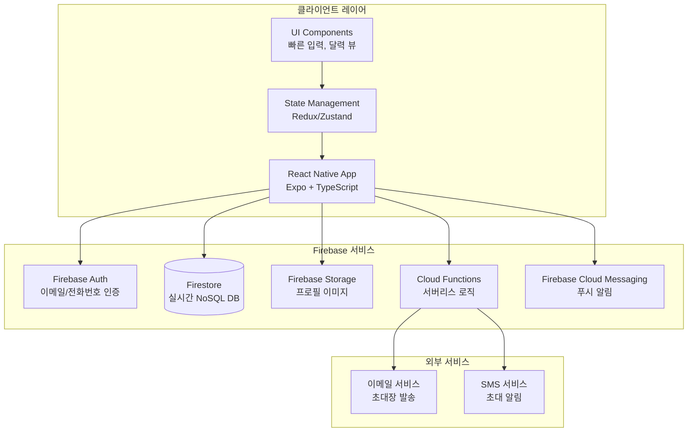
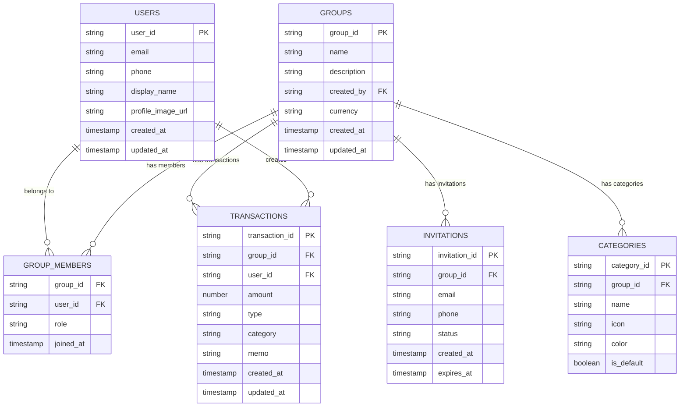
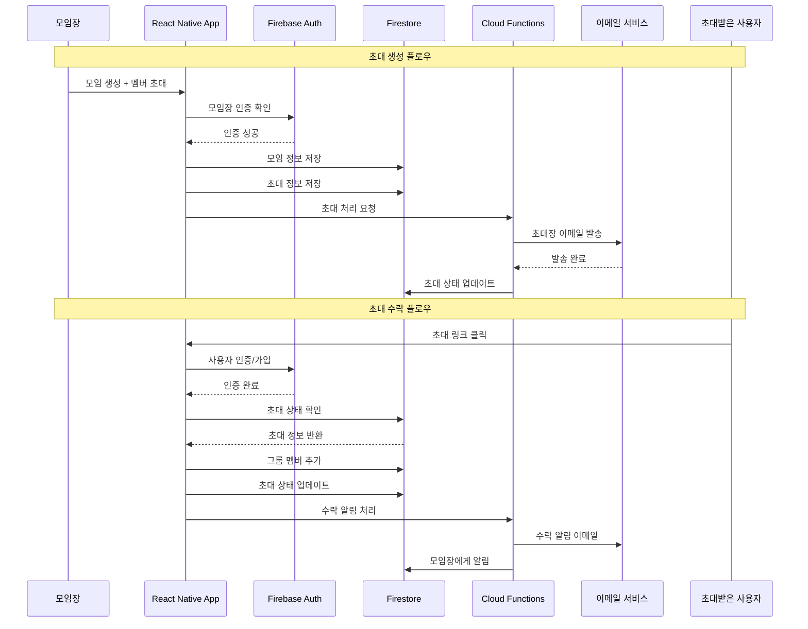
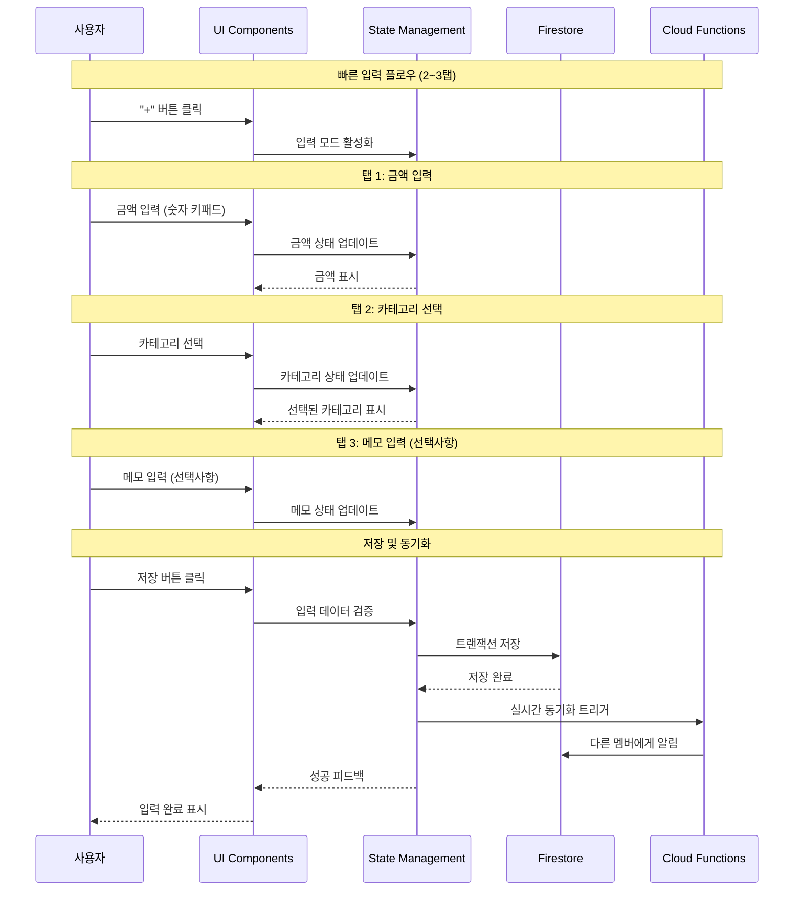
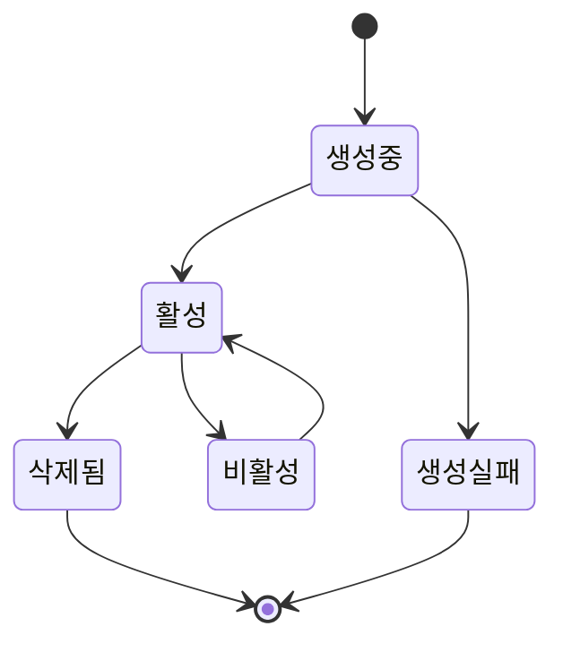
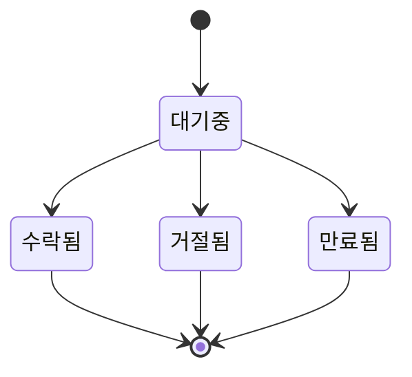
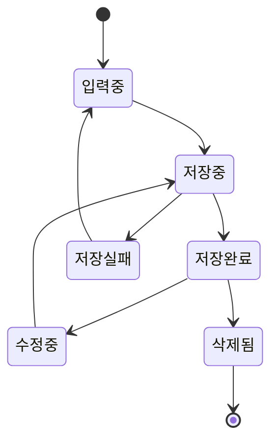

# 모임 가계부 시스템 설계

## 1. 아키텍처 개념도

### 전체 시스템 아키텍처

모임 가계부는 React Native + Firebase 기반의 모바일 크로스플랫폼 애플리케이션으로, 실시간 협업과 빠른 입력 UX를 제공합니다.

**핵심 구성 요소:**
- **프론트엔드**: React Native (Expo, TypeScript)
- **백엔드**: Firebase 서비스 스위트
- **데이터베이스**: Firestore (NoSQL, 실시간 동기화)
- **인증**: Firebase Auth
- **파일 저장**: Firebase Storage
- **서버리스**: Cloud Functions
- **푸시 알림**: Firebase Cloud Messaging (FCM)



### 데이터 모델



## 2. 초대/수락 시퀀스 다이어그램



## 3. 빠른 기록 추가(2~3탭) 시퀀스



## 4. 상태 다이어그램

### 모임 상태 다이어그램



### 초대 상태 다이어그램



### 내역 상태 다이어그램



## 5. 비기능 요구사항

### 보안

#### 인증 및 권한 관리
- **Firebase Auth**: 이메일/전화번호 기반 인증
- **역할 기반 접근 제어 (RBAC)**:
  - 모임장: 모임 관리, 멤버 초대/제거, 설정 변경
  - 멤버: 내역 추가/수정, 조회
- **데이터 접근 제어**: 모임 멤버만 해당 모임 데이터 접근
- **Firestore 보안 규칙**:
```javascript
rules_version = '2';
service cloud.firestore {
  match /databases/{database}/documents {
    // 사용자는 자신의 프로필만 수정 가능
    match /users/{userId} {
      allow read, write: if request.auth != null && request.auth.uid == userId;
    }
    
    // 모임 멤버만 모임 데이터 접근 가능
    match /groups/{groupId} {
      allow read, write: if request.auth != null && 
        exists(/databases/$(database)/documents/groups/$(groupId)/members/$(request.auth.uid));
    }
    
    // 트랜잭션은 모임 멤버만 접근
    match /transactions/{transactionId} {
      allow read, write: if request.auth != null && 
        exists(/databases/$(database)/documents/groups/$(resource.data.group_id)/members/$(request.auth.uid));
    }
  }
}
```

#### 데이터 보안
- **전송 암호화**: HTTPS/TLS 1.3
- **저장 암호화**: Firebase 자동 암호화
- **민감 정보**: 전화번호, 이메일 해시화 저장

### 스케일링 (월간 3만 MAU 가정)

#### 사용자 규모 분석
- **DAU**: 약 1,000명 (MAU의 3.3%)
- **모임당 평균 멤버**: 5명
- **총 모임 수**: 약 6,000개
- **일일 트랜잭션**: 약 5,000건
- **동시 사용자**: 최대 200명

#### Firebase 스케일링 전략

**Firestore 최적화:**
- **인덱싱**: 모임별, 날짜별 복합 인덱스
- **페이지네이션**: 20개씩 로드
- **오프라인 캐싱**: 최근 30일 데이터
- **실시간 리스너**: 필요한 데이터만 구독

**Cloud Functions 최적화:**
- **콜드 스타트 최소화**: 메모리 512MB, 타임아웃 30초
- **배치 처리**: 초대 알림 일괄 발송
- **캐싱**: Redis 캐시 활용

**스토리지 최적화:**
- **이미지 압축**: 프로필 이미지 자동 리사이징
- **CDN**: Firebase Hosting 활용

### 비용 최적화 포인트

#### Firebase 비용 분석 (월간 3만 MAU 기준)

**Firestore 비용:**
- **읽기**: 1,000 DAU × 50회/일 × 30일 = 150만회/월
- **쓰기**: 5,000 트랜잭션/일 × 30일 = 15만회/월
- **저장**: 약 10GB
- **예상 비용**: $150-300/월

**Cloud Functions 비용:**
- **실행 횟수**: 10만회/월
- **실행 시간**: 평균 2초
- **예상 비용**: $50-100/월

**Storage 비용:**
- **저장 용량**: 약 5GB
- **예상 비용**: $10-20/월

**총 예상 비용**: $210-420/월

#### 비용 최적화 전략

**1. Firestore 최적화:**
- **읽기 최소화**: 필요한 필드만 선택
- **캐싱 활용**: 오프라인 캐시 적극 활용
- **배치 작업**: 여러 작업을 한 번에 처리

**2. Cloud Functions 최적화:**
- **함수 통합**: 유사한 기능을 하나의 함수로
- **비동기 처리**: 이메일 발송 등은 비동기로
- **메모리 최적화**: 필요한 메모리만 할당

**3. 스토리지 최적화:**
- **이미지 압축**: 자동 리사이징
- **불필요한 파일 삭제**: 정기적인 정리

**4. 무료 플랜 활용:**
- **Firebase 무료 할당량**:
  - Firestore: 1GB 저장, 50,000 읽기/일, 20,000 쓰기/일
  - Functions: 125,000 호출/월
  - Storage: 5GB 저장, 1GB 다운로드/일

**5. 예상 월 비용 (최적화 후):**
- **1만 MAU**: $50-100/월
- **3만 MAU**: $150-250/월
- **5만 MAU**: $300-500/월

### 성능 모니터링

#### 핵심 지표
- **앱 로딩 시간**: 목표 2초 이내
- **트랜잭션 저장 시간**: 목표 1초 이내
- **실시간 동기화 지연**: 목표 500ms 이내
- **오프라인 동기화**: 목표 5초 이내

#### 모니터링 도구
- **Firebase Performance**: 앱 성능 모니터링
- **Firebase Crashlytics**: 크래시 분석
- **Firebase Analytics**: 사용자 행동 분석
- **Cloud Functions 로그**: 서버리스 함수 모니터링

이러한 시스템 설계를 통해 모임 가계부는 확장 가능하고 안전하며 비용 효율적인 서비스를 제공할 수 있습니다.
